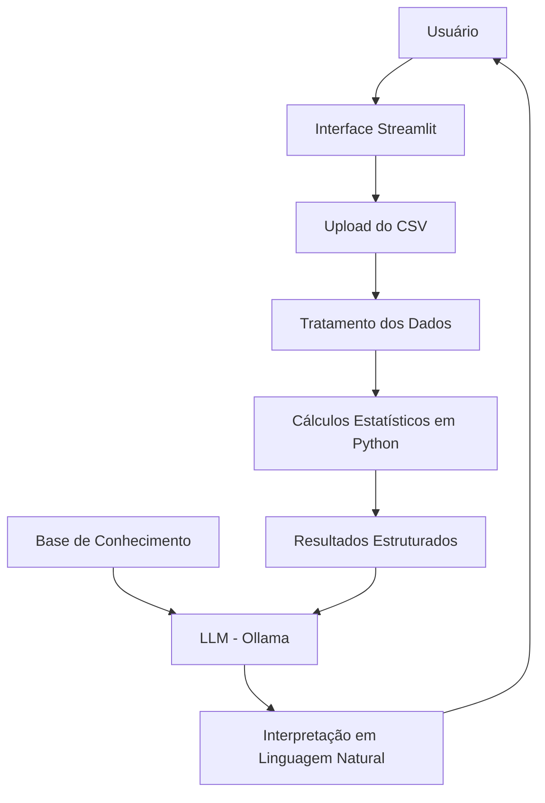

# 📊 CapabiliAI – Agente Inteligente para Análise de Capabilidade de Processos

> Agente de IA Generativa desenvolvido para auxiliar na interpretação de análises de capabilidade de processos industriais, utilizando Python para tratamento de dados e cálculos estatísticos e um modelo de linguagem executado localmente pelo Ollama para geração de explicações em linguagem natural.

---

# 💡 O que é o CapabiliAI?

O CapabiliAI é um assistente inteligente especializado na análise de capabilidade de processos industriais.

Seu objetivo é apoiar profissionais da qualidade na interpretação dos indicadores estatísticos calculados pela aplicação, fornecendo explicações técnicas, didáticas e contextualizadas.

O agente **não realiza cálculos estatísticos**. Todos os cálculos são executados em Python. O modelo de linguagem interpreta apenas os resultados produzidos pela aplicação.

---

# ✅ O que o CapabiliAI faz

- Analisa arquivos CSV contendo medições do processo.
- Realiza tratamento inicial dos dados.
- Calcula estatísticas descritivas.
- Calcula os índices Cp, Cpu, Cpl e Cpk.
- Identifica o lado crítico da especificação.
- Calcula o percentual observado fora da especificação.
- Explica o significado dos indicadores utilizando linguagem técnica e acessível.
- Utiliza uma Base de Conhecimento composta por arquivos Markdown e JSON.
- Responde perguntas relacionadas aos resultados obtidos.

---

# ❌ O que o CapabiliAI NÃO faz

- Não recalcula indicadores utilizando o LLM.
- Não inventa resultados.
- Não cria limites de especificação.
- Não identifica causa-raiz como um fato comprovado.
- Não afirma que o processo está sob controle estatístico apenas pelo valor do Cpk.
- Não aprova ou reprova produtos, lotes ou processos.
- Não substitui um especialista em Engenharia da Qualidade.

---

# 🏗️ Arquitetura



---

# Fluxo de Funcionamento

1. O usuário envia um arquivo CSV contendo as medições.
2. A aplicação valida e trata os dados.
3. O Python calcula os indicadores estatísticos.
4. Os resultados são enviados ao modelo de linguagem.
5. O modelo consulta a Base de Conhecimento.
6. O CapabiliAI gera uma interpretação em linguagem natural.

---

# Tecnologias Utilizadas

| Tecnologia | Finalidade |
|------------|------------|
| Python | Tratamento dos dados e cálculos estatísticos |
| Pandas | Manipulação dos dados |
| Streamlit | Interface da aplicação |
| Ollama | Execução local do modelo de linguagem |
| GPT-OSS | Modelo de linguagem |
| Markdown | Base de Conhecimento |
| JSON | Critérios de interpretação |

---

# 📁 Estrutura do Projeto

```text
CapabiliAI/
│
├── data/
│   ├── conceitos_capabilidade.md
│   ├── criterios_interpretacao.json
│   ├── formulas.md
│   ├── limitacoes.md
│   └── exemplos_respostas.md
│
├── docs/
│   ├── 01-documentacao-agente.md
│   ├── 02-base-conhecimento.md
│   ├── 03-prompts.md
│   ├── 04-metricas.md
│   └── 05-pitch.md
│
├── src/
│   ├── app.py
│   ├── analise.py
│   ├── llm.py
│   ├── prompts.py
│   └── README.md
│
├── requirements.txt
└── README.md
```

---

# Base de Conhecimento

A interpretação dos resultados utiliza cinco arquivos definidos na documentação do projeto.

| Arquivo | Finalidade |
|----------|------------|
| conceitos_capabilidade.md | Conceitos sobre capabilidade de processos |
| criterios_interpretacao.json | Critérios para classificação dos indicadores |
| formulas.md | Fórmulas estatísticas utilizadas na análise |
| limitacoes.md | Regras de segurança e limitações do agente |
| exemplos_respostas.md | Exemplos de respostas esperadas (Few-Shot Prompt) |

---

# 🚀 Como Executar

## 1. Instalar o Ollama

```bash
ollama pull gpt-oss
```

Inicie o serviço:

```bash
ollama serve
```

---

## 2. Instalar as dependências

```bash
pip install -r requirements.txt
```

---

## 3. Executar a aplicação

```bash
streamlit run src/app.py
```

Após a inicialização:

```
http://localhost:8501
```

---

# Exemplo de Utilização

### Entrada

Arquivo CSV contendo as medições.

LIE = 49

LSE = 51

---

### Resultados calculados pelo Python

- Média = 49,98
- Desvio-padrão = 0,21
- Cp = 1,59
- Cpk = 1,53

---

### Pergunta

> O processo é capaz?

---

### Resposta do CapabiliAI

> Os indicadores sugerem que o processo apresenta boa capacidade em relação aos limites de especificação. O valor de Cpk indica que a média encontra-se relativamente centralizada e que a variabilidade observada é compatível com a faixa de especificação. Entretanto, a análise de capabilidade não comprova, por si só, que o processo esteja estatisticamente sob controle. Recomenda-se complementar a avaliação utilizando gráficos de controle.

---

# Métricas de Avaliação

| Métrica | Objetivo |
|----------|----------|
| Assertividade | Interpretar corretamente os indicadores calculados |
| Clareza | Explicar os resultados de forma objetiva |
| Segurança | Evitar alucinações e informações não suportadas |
| Coerência | Utilizar apenas os dados fornecidos |
| Robustez | Tratar corretamente cenários com dados insuficientes |

---

# Diferenciais

- Cálculos estatísticos executados exclusivamente em Python.
- Modelo de linguagem executado localmente com Ollama.
- Base de Conhecimento própria.
- Separação entre cálculo estatístico e interpretação.
- Arquitetura modular e de fácil manutenção.
- Estratégias de mitigação de alucinação documentadas.
- Projeto alinhado às boas práticas de Engenharia da Qualidade.

---

# Documentação

Toda a documentação do projeto encontra-se na pasta `docs/`.

Ela inclui:

- Caso de uso;
- Persona do agente;
- Arquitetura;
- Base de Conhecimento;
- Estratégia de prompts;
- Métricas de avaliação;
- Pitch de apresentação.

---

# Observações

Este projeto possui finalidade educacional e demonstra a integração entre técnicas de tratamento de dados, análise estatística e Inteligência Artificial Generativa.

O CapabiliAI deve ser utilizado como ferramenta de apoio à interpretação dos resultados, não substituindo a análise realizada por profissionais qualificados.
