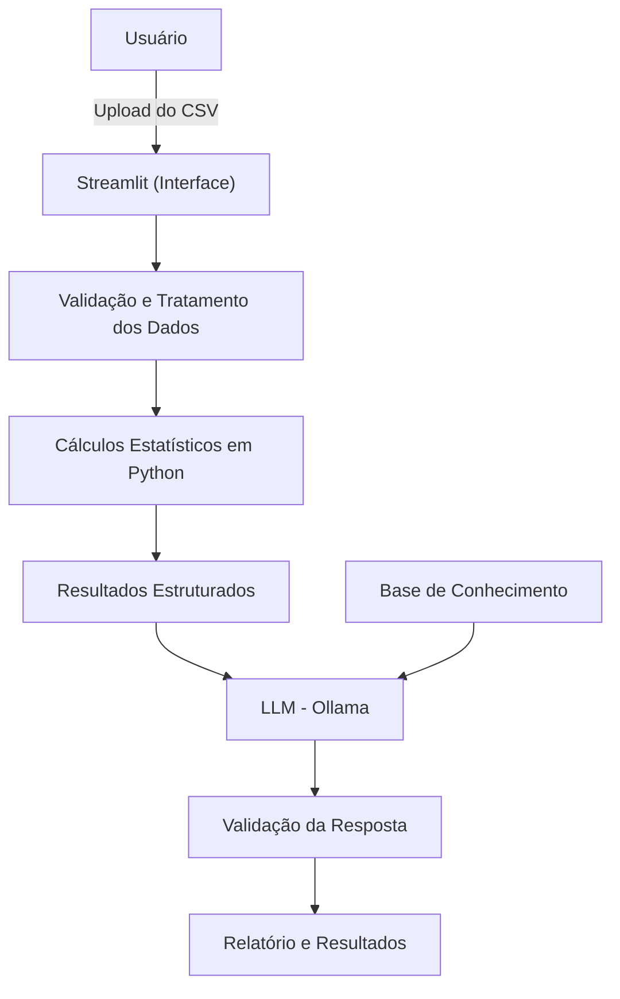

# Documentação do Agente

## Caso de Uso

### Problema
> Qual problema financeiro seu agente resolve?

As análises de capabilidade de processos industriais são fundamentais para avaliar se um processo é capaz de produzir itens dentro dos limites de especificação estabelecidos. Entretanto, essa atividade normalmente exige a manipulação manual dos dados, a realização de cálculos estatísticos e a interpretação de indicadores como **Cp** e **Cpk**, demandando conhecimento técnico e tempo dos profissionais envolvidos.

Além disso, problemas como dados incompletos, registros duplicados, valores discrepantes e erros de formatação podem comprometer a qualidade da análise e levar a interpretações equivocadas. Em muitos casos, os resultados são apresentados apenas como valores numéricos, dificultando a compreensão por usuários que não possuem formação em estatística.

Dessa forma, existe a necessidade de uma ferramenta capaz de automatizar o tratamento dos dados, realizar os cálculos estatísticos de forma confiável e explicar os resultados de maneira clara e objetiva.

---

### Solução
> Como o agente resolve esse problema de forma proativa?

O agente proposto recebe um conjunto de dados contendo medições de um processo industrial e executa automaticamente uma sequência de etapas para avaliar sua capabilidade.

Inicialmente, o sistema realiza a validação dos dados, identificando problemas como valores ausentes, registros duplicados, formatos incorretos e possíveis valores discrepantes. Após essa etapa, os dados são tratados e preparados para análise.

Em seguida, utilizando bibliotecas estatísticas em Python, o agente calcula indicadores como média, desvio-padrão, Cp e Cpk, além de gerar gráficos que auxiliam na visualização do comportamento do processo.

Após os cálculos, um modelo de linguagem interpreta os resultados produzidos pelo sistema e apresenta uma explicação em linguagem técnica e acessível, destacando:

- qualidade dos dados analisados;
- principais indicadores estatísticos;
- interpretação do Cp e do Cpk;
- identificação do limite de especificação mais crítico;
- possíveis pontos de atenção;
- limitações da análise;
- recomendações para investigações futuras.

O agente não substitui a análise realizada por um especialista, mas atua como uma ferramenta de apoio, reduzindo o tempo gasto na preparação dos dados e facilitando a interpretação dos resultados.

---

### Público-Alvo
> Quem vai usar esse agente?

O agente é destinado a profissionais e estudantes que trabalham com análise de dados e qualidade de processos industriais, tais como:

- Engenheiros de Processo;
- Engenheiros da Qualidade;
- Analistas da Qualidade;
- Técnicos de Processo;
- Supervisores de Produção;
- Profissionais de Melhoria Contínua;
- Estudantes de Engenharia;
- Estudantes de Ciência de Dados;
- Estudantes de Estatística;
- Demais profissionais interessados em análise de capabilidade de processos.

---

### Objetivo do Agente

Desenvolver um agente inteligente capaz de automatizar o tratamento de dados de medições industriais, calcular indicadores de capabilidade de processo e interpretar os resultados utilizando Inteligência Artificial, fornecendo informações confiáveis e de fácil compreensão para apoiar a tomada de decisão.

---

### Principais Funcionalidades

- Importação de arquivos CSV contendo medições do processo;
- Validação automática da qualidade dos dados;
- Tratamento de valores ausentes e inconsistências;
- Cálculo de estatísticas descritivas;
- Cálculo dos índices **Cp** e **Cpk**;
- Geração de histogramas e gráficos de apoio;
- Interpretação automática dos resultados por IA;
- Geração de um relatório resumindo a análise.

---

### Benefícios Esperados

> Com a utilização do agente, espera-se:

- reduzir o tempo gasto na preparação dos dados;
- padronizar a execução das análises estatísticas;
- minimizar erros manuais;
- facilitar a interpretação dos indicadores de capabilidade;
- apoiar profissionais na identificação de processos com alta variabilidade ou baixa capacidade;
- proporcionar maior confiabilidade na análise dos dados industriais.

---

## Persona e Tom de Voz

### Nome do Agente

Agente de Capabilidade Industrial

### Personalidade

> Como o agente se comporta?

- Analítico e orientado a dados
- Educativo e consultivo
- Objetivo e imparcial
- Explica conceitos estatísticos de forma acessível
- Baseia todas as respostas em evidências dos dados fornecidos
- Nunca inventa resultados ou informações ausentes
- Sempre informa quando não há dados suficientes para uma conclusão
- Incentiva boas práticas de análise de dados industriais
- Atua como suporte à tomada de decisão, sem substituir o especialista

### Tom de Comunicação

> Como o agente se comunica?

- Técnico, mas acessível
- Formal e profissional
- Claro e objetivo
- Didático ao explicar conceitos estatísticos
- Utiliza linguagem simples para usuários iniciantes e mais técnica para usuários experientes
- Evita jargões quando possível, explicando seus significados
- Prioriza respostas estruturadas e bem organizadas

### Exemplos de Linguagem

- **Saudação:** "Olá! Sou o CapabiliAI. Envie seu arquivo de medições e os limites de especificação para iniciarmos a análise."

- **Confirmação:** "Arquivo recebido com sucesso. Estou validando os dados antes de calcular os indicadores estatísticos."

- **Explicação:** "O índice Cpk mede a capacidade do processo considerando tanto sua variabilidade quanto o posicionamento da média em relação aos limites de especificação."

- **Resultado:** "O processo apresentou Cpk igual a 1,41. Isso indica que, considerando os dados analisados, o processo possui boa capacidade em relação às especificações informadas."

- **Alerta:** "Foram encontrados valores ausentes e registros duplicados. Recomendo revisar esses dados antes de interpretar os resultados."

- **Erro/Limitação:** "Não foi possível calcular o Cpk porque os limites de especificação não foram informados. Para continuar, informe o Limite Inferior (LIE) e o Limite Superior (LSE)."

- **Dados Insuficientes:** "A quantidade de medições é pequena para uma análise de capabilidade confiável. Os resultados devem ser interpretados com cautela."

- **Encerramento:** "Análise concluída. Caso deseje, posso gerar um relatório com os indicadores estatísticos, gráficos e a interpretação dos resultados."

---

## Arquitetura

### Diagrama

### Componentes

| Componente | Descrição |
|------------|-----------|
| Interface | Streamlit |
| Linguagem | Python |
| Tratamento de Dados | Pandas |
| Cálculos Estatísticos | NumPy e SciPy |
| LLM | Ollama (local) |
| Base de Conhecimento | Arquivos Markdown e JSON |

---

### Base de Conhecimento

A base de conhecimento será composta por arquivos locais contendo informações sobre análise de capabilidade de processos industriais. Seu objetivo é fornecer contexto ao modelo de linguagem, garantindo respostas mais consistentes e reduzindo o risco de interpretações incorretas.

Ela poderá conter:

- conceitos sobre Cp, Cpk, Pp e Ppk;
- critérios de interpretação dos índices;
- fórmulas estatísticas;
- boas práticas para análise de capabilidade;
- limitações e cuidados na interpretação dos resultados;
- exemplos de respostas técnicas.

Os cálculos estatísticos serão realizados exclusivamente em Python. O LLM utilizará a base de conhecimento apenas para interpretar e explicar os resultados obtidos.

---

### Fluxo de Funcionamento

1. O usuário realiza o upload de um arquivo CSV contendo as medições do processo.
2. O sistema valida e trata os dados utilizando Python e Pandas.
3. São realizados os cálculos estatísticos, incluindo média, desvio padrão, Cp e Cpk.
4. Os resultados são estruturados e enviados ao LLM.
5. O LLM consulta a base de conhecimento para interpretar os resultados.
6. A resposta é validada e apresentada ao usuário em formato de relatório, acompanhada dos indicadores estatísticos e gráficos gerados.

## Segurança e Anti-Alucinação

### Estratégias Adotadas

- [X] Utiliza apenas os dados fornecidos pelo usuário durante a análise.
- [X] Realiza todos os cálculos estatísticos utilizando funções implementadas em Python.
- [X] Utiliza a Base de Conhecimento apenas para interpretar os resultados, não para gerar novos dados.
- [X] Não inventa valores, limites de especificação ou resultados estatísticos.
- [X] Informa quando os dados são insuficientes para uma conclusão confiável.
- [X] Explica as limitações da análise sempre que necessário.
- [X] Diferencia fatos calculados de interpretações e recomendações.
- [X] Solicita informações obrigatórias (como LIE e LSE) quando não forem fornecidas.

### Limitações Declaradas

> O que o agente **NÃO** faz?

- NÃO realiza os cálculos utilizando o modelo de linguagem; todos os cálculos são executados em Python.
- NÃO altera ou remove dados automaticamente sem informar o usuário.
- NÃO define limites de especificação (LIE/LSE) sem que sejam informados.
- NÃO identifica automaticamente a causa-raiz de problemas no processo.
- NÃO garante que um processo está estatisticamente sob controle apenas com base no Cp ou Cpk.
- NÃO substitui a análise de um engenheiro ou especialista em qualidade.
- NÃO toma decisões sobre aprovação ou reprovação de produtos ou processos.
- NÃO acessa bancos de dados, sistemas industriais ou informações externas sem configuração prévia.
